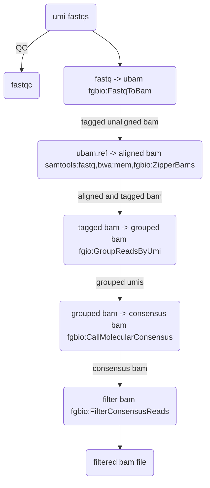

# nf-core/fastqtoconsensus: Documentation
The nf-core/fastqtoconsensus documentation is split into the following pages:
- [Usage](usage.md)
  - An overview of how the pipeline works, how to run it and a description of all of the different command-line flags.

- [Output](output.md)

  - An overview of the different results produced by the pipeline and how to interpret them.
The pipeline processes UMI fastqs through to bam

